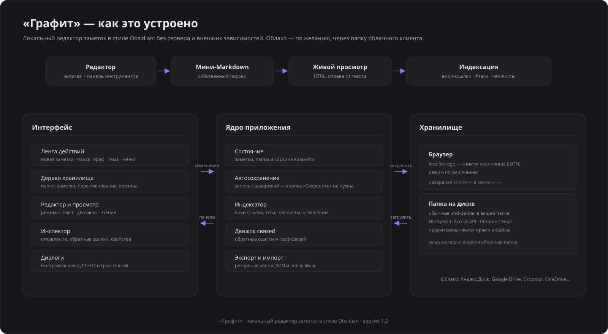
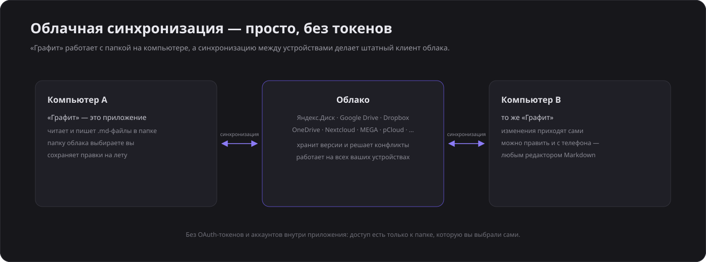

# Графит

**Графит** — лёгкий локальный редактор заметок в стиле Obsidian.

**Живая версия:** [hoccku22.github.io/grafit](https://hoccku22.github.io/grafit/) — открывается с любого устройства.

Обычные Markdown-файлы, живой предпросмотр, вики-ссылки, теги, поиск, граф связей и облачная синхронизация через папку любимого облака. Без сервера, без сборки и без единой зависимости — это просто статический сайт из HTML, CSS и JS.



## Возможности

- **Хранилище и файлы** — дерево папок и заметок, переименование с автообновлением вики-ссылок, корзина с восстановлением.
- **Markdown и предпросмотр** — заголовки, списки и чек-листы, таблицы, блоки кода, цитаты, frontmatter; режимы «Текст», «Два окна», «Чтение».
- **Связи и теги** — вики-ссылки `[[Заметка]]` с переходом и автосозданием, обратные ссылки, панель тегов, оглавление.
- **Поиск** — полнотекстовый поиск по всему хранилищу и быстрый переход `Ctrl+O`.
- **Граф связей** — карта заметок; размер узла — число связей.
- **Облачная синхронизация** — подключите папку Яндекс.Диска, Google Drive, Dropbox, OneDrive, Nextcloud, MEGA, pCloud или другого сервиса: приложение пишет `.md`-файлы, а облачный клиент разносит их по устройствам.
- **ИИ-помощник** — подключается любой OpenAI-совместимый сервис (OpenRouter, OpenAI, Groq, локальный Ollama): следит за текстом, подсказывает форматирование и структуру, исправляет опечатки, предлагает определения.
- **Экспорт и импорт** — резервная копия в JSON, скачивание заметок в `.md`, импорт файлов.
- **Темы** — тёмная и светлая.

## Быстрый старт

1. Скачайте репозиторий кнопкой **Code → Download ZIP** (или склонируйте: `git clone <адрес-репозитория>`).
2. Откройте `index.html` в Chrome, Edge или другом современном браузере — всё работает сразу, без установки.
3. По желанию: кнопка «облако» в левой ленте — подключите облачную папку и синхронизируйте заметки между устройствами.

Репозиторий — самый обычный статический сайт: его можно раздать через любой хостинг. Для GitHub Pages всё уже готово:

1. Отправьте репозиторий на GitHub (через `git push` или GitHub Desktop).
2. Откройте **Settings → Pages**.
3. Source: **Deploy from a branch**, ветка **main**, папка **/ (root)** → **Save**.
4. Через минуту «Графит» будет доступен по адресу `https://ваш-логин.github.io/grafit/`.

Если аккаунт GitHub бесплатный — выбирайте публичный репозиторий: в нём лежит только код приложения (заметки никуда не публикуются).

## Облачная синхронизация

«Графит» не просит пароли и не требует OAuth-токенов: он работает с обычной папкой на диске, которую синхронизирует штатный клиент вашего облака. Поэтому поддерживается почти любой сервис — от Яндекс.Диска и Google Drive до Nextcloud и MEGA.



1. Установите приложение облака — появится папка синхронизации.
2. В «Графите» нажмите кнопку с облаком и выберите свой сервис.
3. Укажите папку (можно вложенную, например «Заметки») — правки будут сохраняться в `.md`-файлы и разноситься по устройствам. Изменения с других устройств подтягиваются автоматически.

## Горячие клавиши

| Действие | Клавиши |
|---|---|
| Новая заметка | `Ctrl + N` |
| Быстрый переход | `Ctrl + O` |
| Поиск по хранилищу | `Ctrl + Shift + F` |
| Режим просмотра | `Ctrl + E` |
| Жирный / курсив | `Ctrl + B` / `Ctrl + I` |
| Инспектор | `Ctrl + \` |
| Проверить текст с ИИ | `Ctrl + Shift + A` |

## ИИ-помощник

По желанию подключается любой сервис с OpenAI-совместимым API: OpenRouter, OpenAI, Groq, локальный Ollama и другие (можно указать свой адрес).

1. Получите API-ключ в выбранном сервисе (в OpenRouter есть бесплатные модели).
2. В «Графите» нажмите кнопку-искру в левой ленте и вставьте ключ, выберите модель.
3. Нажмите «Проверить соединение», включите помощника — он начнёт следить за текстом.

Что умеет: исправлять опечатки и пунктуацию, поправлять Markdown-оформление, предлагать структуру, а для незаконченного определения («Слово — ») — предложить готовое определение одним кликом. Все правки применяются только по вашему клику.

Ключ хранится только в браузере, текст отправляется в выбранный вами сервис. На предпросмотре AutoClaw внешние запросы блокируются политикой хостинга — используйте версию на GitHub Pages или локально.

## Структура проекта

```text
index.html            приложение (открывается в браузере)
assets/app.js         логика: хранилище, редактор, поиск, граф, синхронизация
assets/markdown.js    мини-парсер Markdown
assets/seeds.js       стартовые заметки
assets/styles.css     оформление (тёмная и светлая темы)
assets/*.svg          иконка и схемы
```

## Лицензия

MIT — используйте, изменяйте и распространяйте свободно (см. [LICENSE](LICENSE)).

«Графит» — самостоятельный проект, вдохновлённый Obsidian; не связан с Obsidian.md.
