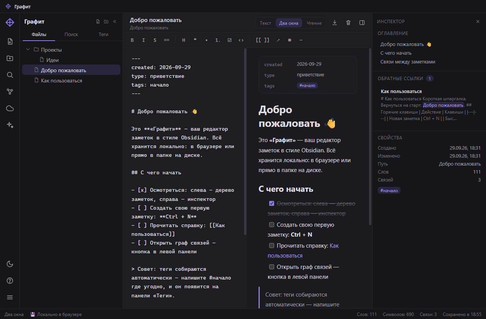
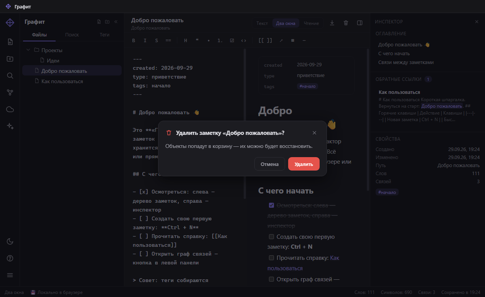
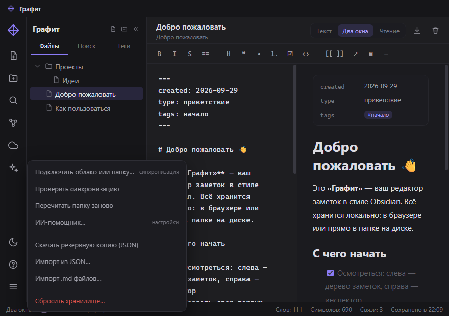

# Графит

**Заметки в стиле Obsidian. Живут в ваших файлах.**

[](https://github.com/Hoccku22/grafit/releases/latest)
[](LICENSE)


«Графит» — бесплатный редактор заметок в стиле Obsidian: **настоящая программа для Windows** и **веб-версия** из одного кодового дерева. Все заметки — обычные `.md`-файлы в папке, которую вы выбираете сами.

[**Скачать для Windows**](https://github.com/Hoccku22/grafit/releases/latest) · [Веб-версия](https://hoccku22.github.io/grafit/app/) · [Роадмап](https://hoccku22.github.io/grafit/docs/roadmap.html)



## Возможности

- **Ваши файлы.** Заметки — обычные `.md`: открываются в Obsidian, VS Code, «Блокноте». Никаких замков.
- **Облачная синхронизация.** Подключите папку Яндекс.Диска, Google Drive, Dropbox, OneDrive, Nextcloud — без токенов и паролей. Изменения из папки подхватываются мгновенно.
- **ИИ-помощник.** Подсказки по тексту, опечатки, формулировки. Локальные модели (Ollama) или любой OpenAI-совместимый сервис.
- **Скорость.** Мгновенный поиск, быстрый переход `Ctrl+O`, теги, граф связей. Горячие клавиши работают в любой раскладке.
- **Подсказки в тексте.** Новый редактор: подсветка Markdown, номера строк, сворачивание разделов. Продолжения ИИ — серым текстом, Tab принимает; вызов — Alt Alt или Ctrl+Space, а с включённым «Авто» подсказки появляются сами.
- **Быстрая заметка.** `Ctrl+Alt+N` из любой программы: мини-окно поверх всех окон — записали мысль и спрятали. Значок в трее.
- **Тёмная и светлая темы.** Включая фирменные диалоги вместо системных окон и системные кнопки окна в цвет интерфейса.
- **Без аккаунтов.** Никаких регистраций, подписок и телеметрии. Работает офлайн.

## Скачать

| Файл | Что это |
|---|---|
| [Графит-0.5.1-portable.exe](https://github.com/Hoccku22/grafit/releases/latest) | Портативная версия: один файл, без установки |
| [Графит-0.5.1-setup.exe](https://github.com/Hoccku22/grafit/releases/latest) | Установщик: ярлыки в «Пуск» и на рабочем столе |
| [Веб-версия](https://hoccku22.github.io/grafit/app/) | Открыть в браузере — ничего скачивать не нужно |

## Скриншоты





## Как это устроено

1. Выбираете папку — на диске или внутри облачного клиента.
2. Пишете заметки в Markdown — «Графит» сохраняет их файлами.
3. Облачный клиент синхронизирует папку между устройствами.

## Структура репозитория

- `app/` — веб-версия «Графита» (открывается и локально, и на GitHub Pages).
- `desktop/` — программа для Windows (Electron): исходники, сборка, документация.
- `docs/` — [роадмап](docs/roadmap.html) и [обзор версии 0.2](docs/overview.html).
- `media/` — скриншоты для страниц проекта.

## Разработка

Программа (папка `desktop/`):

```powershell
npm install        # один раз
npm start          # запустить без сборки
npm run smoke      # автопроверка интерфейса
npm run dist       # собрать portable + установщик в dist/
```

Веб-версия — статические файлы в `app/`, сборка не нужна: достаточно открыть `app/index.html`.

## Лицензия

[MIT](LICENSE) — пользуйтесь, изучайте, улучшайте.
